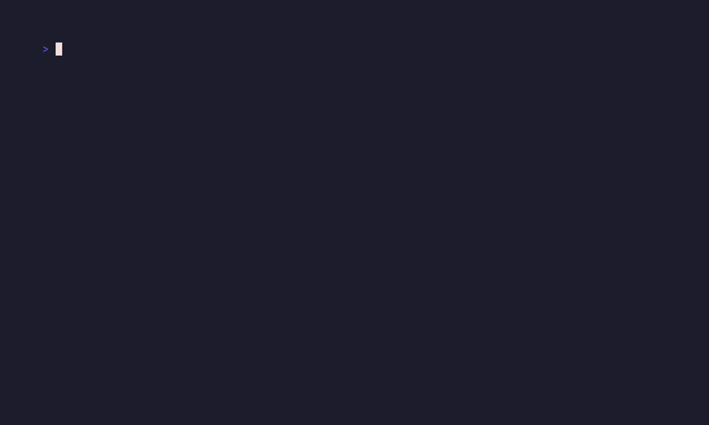

# treeward



> **treeward** (n.)
> *A filesystem ward bound to a directory tree, keeping watch for corruption, silent edits, and other lurking horrors.*

A command-line file integrity tool that maintains SHA-256 checksums and metadata for directory trees. Treeward uses a distributed approach where each directory contains a `.treeward` file tracking its immediate children, allowing directories to be moved independently while maintaining integrity information.

## Features

- **Efficient incremental updates** - Only checksums files that are new or have changed metadata (mtime/size)
- **Fingerprint validation** - Prevents TOCTOU race conditions with cryptographic fingerprints
- **Multiple verification modes** - Fast metadata checks, selective checksumming, or full integrity audits
- **Distributed ward model** - Each directory tracks only its immediate children (non-recursive per-directory), allowing moving directories around
as self-contained warded units.
- **Dry run support** - Preview what would be changed without writing any files
- **Automation-friendly** - Clean exit codes and simple output for monitoring and CI/CD

## Installation

```bash
cargo install --path .
```
## Quick Start

Initialize a directory tree:

```bash
# From within the directory
cd /path/to/project
treeward init

# Or without changing directory
treeward -C /path/to/project init
```

Check what has changed:

```bash
treeward status
```

Update ward files to record new state:

```bash
treeward update
```

Verify integrity (automation/monitoring):

```bash
treeward verify
```

## Commands

### `init` - Initialize ward files

Performs first-time initialization of `.treeward` files in a directory tree. Checksums all files and creates ward metadata.

```bash
# Initialize current directory
treeward init

# Initialize specific directory (without cd)
treeward -C /path/to/project init

# Preview without writing files
treeward init --dry-run

# Safe initialization with fingerprint validation
FP=$(treeward status | grep '^Fingerprint:' | cut -d' ' -f2)
treeward init --fingerprint $FP
```

**Note:** Fails if already initialized. Use `treeward update` for subsequent changes, or `treeward update --allow-init` for idempotent behavior.

### `update` - Update ward files

Updates existing `.treeward` files to reflect current state. Only checksums new or modified files (efficient for incremental changes).

```bash
# Update current directory
treeward update

# Update specific directory (without cd)
treeward -C /path/to/project update

# Preview what would be updated
treeward update --dry-run

# Update with fingerprint validation (safe workflow)
FP=$(treeward status | grep '^Fingerprint:' | cut -d' ' -f2)
treeward update --fingerprint $FP

# Update or initialize (idempotent, for scripts)
treeward update --allow-init
```

**Update modes:**
- `treeward update` - Fails if not initialized (safe, explicit)
- `treeward update --allow-init` - Works whether initialized or not (idempotent)

### `status` - Show changes

Compares current filesystem state against existing `.treeward` files to detect changes.

```bash
# Fast metadata-only check (default)
treeward status

# Verify checksums for files with changed metadata
treeward status --verify

# Always verify checksums for all files (detect silent corruption)
treeward status --always-verify
```

**Change types:**
- `Added` - New files, directories, or symlinks not in the ward
- `Removed` - Entries in the ward that no longer exist
- `PossiblyModified` - Files whose metadata (mtime/size) differs from ward
- `Modified` - Files whose checksums differ from ward (requires `--verify`)

**Fingerprints:**

Every status check produces a unique fingerprint representing the exact changeset. Use it with `init --fingerprint` or `update --fingerprint` to ensure you're applying exactly the changes you reviewed:

```bash
treeward status > review.txt
cat review.txt  # Review changes
FP=$(grep '^Fingerprint:' review.txt | cut -d' ' -f2)
treeward update --fingerprint $FP
```

### `verify` - Comprehensive integrity check

Verifies integrity of all files by checksumming everything and comparing against the ward. Designed for automation and monitoring.

```bash
# Verify current directory
treeward verify

# Verify specific directory (without cd)
treeward -C /path/to/data verify

# Use in scripts (exit code 0 = success)
treeward -C /critical/data verify || alert_admin

# Cron job
0 2 * * * /usr/local/bin/treeward -C /data verify || mail admin

# CI/CD pipeline
treeward -C ./dist verify && deploy.sh
```

**Exit codes:**
- `0` - All files match their wards (success)
- `non-zero` - Changes detected or errors encountered (failure)

## Typical Workflow

```bash
# 1. Initialize a directory tree
cd /path/to/project
treeward init

# 2. Make changes to your files
# ... edit, add, remove files ...

# 3. Check what changed
treeward status

# 4. Update ward files to record new state
treeward update

# 5. Periodically verify integrity
treeward verify
```

## Common Use Cases

### Track changes in a project

```bash
cd /my/project
treeward init
# ... work on project ...
treeward status --verify
```

### Safe update workflow (prevents TOCTOU)

```bash
treeward status > review.txt
cat review.txt  # Review changes carefully
FP=$(grep '^Fingerprint:' review.txt | cut -d' ' -f2)
treeward update --fingerprint $FP
```

### Detect data corruption

```bash
treeward -C /critical/data status --always-verify
```

### Automated integrity monitoring

```bash
#!/bin/bash
if ! treeward -C /data verify; then
  echo "Integrity check failed!" | mail admin@example.com
  exit 1
fi
```

### CI/CD artifact verification

```yaml
- name: Verify build artifacts
  run: |
    treeward -C ./dist init
    # ... build process ...
    treeward -C ./dist verify
```

### Idempotent scripting

```bash
# Works whether initialized or not
treeward update --allow-init
```

## How It Works

### Non-recursive per-directory model

Each directory contains a `.treeward` TOML file with metadata only for its **immediate children** (files, subdirectories, symlinks). This allows:

- Directories to be moved independently
- Incremental verification of subdirectories
- Clear organization of integrity metadata

Example `.treeward` file:

```toml
[metadata]
version = 1

[entries."README.md"]
type = "File"
sha256 = "e3b0c44298fc1c149afbf4c8996fb92427ae41e4649b934ca495991b7852b855"
mtime_nanos = 1234567890123456789
size = 1024

[entries."src"]
type = "Dir"

[entries."link"]
type = "Symlink"
symlink_target = "target/path"
```

### Efficient incremental updates

When updating, treeward:
1. Compares filesystem metadata (mtime/size) against ward
2. Only checksums files that are new or have changed metadata
3. Reuses checksums for unchanged files
4. Only rewrites `.treeward` files if contents changed

This makes subsequent updates very fast - only changed files are checksummed.

### Concurrent modification detection

Before and after checksumming a file, treeward compares mtime to detect changes during the read operation. If detected, it returns an error (no retry logic). Note that detection can never be guaratneed and should be considered
a courtesy best effort.

### TOCTOU protection

Fingerprints prevent time-of-check-time-of-use race conditions:

1. Run `treeward status` to review changes and get a fingerprint
2. Review the changes
3. Run `treeward update --fingerprint <FINGERPRINT>` to apply those exact changes

If files change between status and update, the fingerprint won't match and the update fails without writing any ward files.

## Design Principles

1. **Non-recursive directory model** - Each directory has its own `.treeward` file containing metadata only for its immediate children
2. **Deterministic serialization** - `BTreeMap` ensures stable TOML output
3. **Error handling philosophy** - Corrupted ward files and permission errors are fatal; never silently skip problems
4. **High-precision timestamps** - Nanosecond-precision timestamps for accurate modification detection
5. **Security-conscious** - SHA-256 checksums, concurrent modification detection, TOCTOU protection

## Development

Standard Rust idioms apply:

* `cargo test`
* `cargo fmt`
* `cargo clippy -- -D warnings`

## License

See LICENSE file for details.
